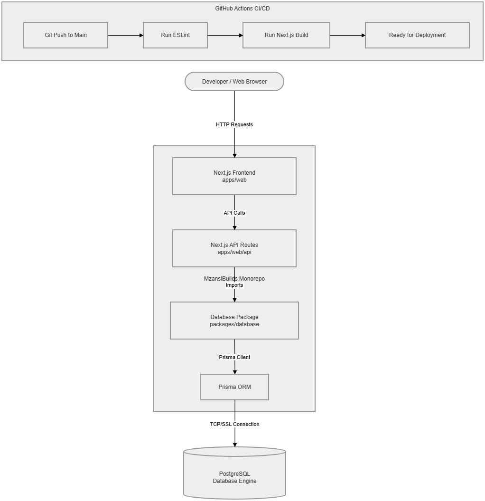
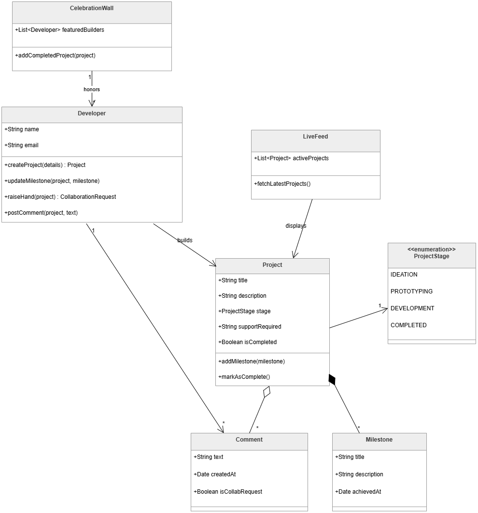
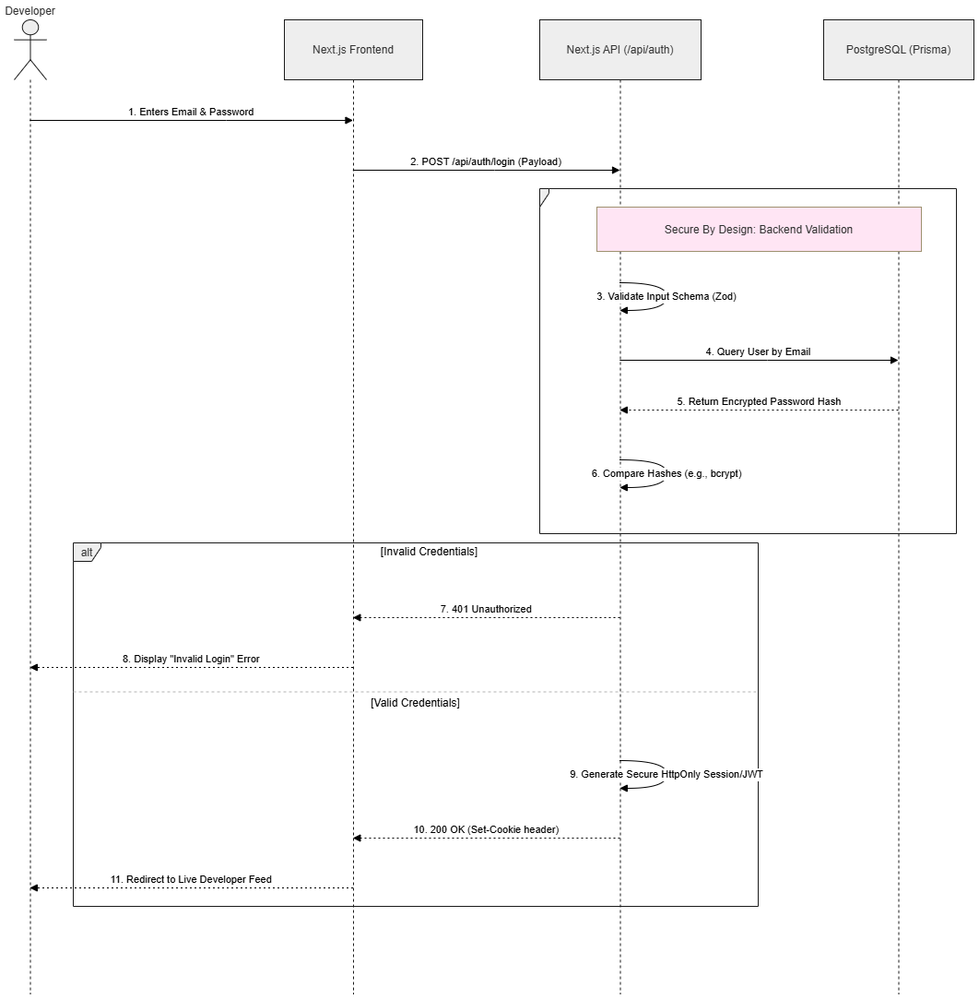

# MzansiBuilds: Architecture & System Design

## Overview
This document outlines the architectural decisions, domain modeling, and security protocols implemented for the MzansiBuilds platform. The system is built utilizing a Turborepo monorepo structure, ensuring separation of concerns, high reusability and scalability.

---

## 1. System Architecture

**Architectural Justification:**
The MzansiBuilds platform is designed using a Serverless Monolith approach within a Turborepo workspace. By abstracting the Prisma ORM and database connection into a dedicated `@repo/database` package, the system achieves maximum **Efficiency and Reusability**. If the platform scales to include a mobile application or a microservice backend in the future, the core data logic remains centralized and perfectly synchronized across all applications.

---

## 2. Domain Model (Business Logic)

**Architectural Justification:**
The core business logic was mapped utilizing strict Object-Oriented principles.
* **Clear Entity Relationships:** The model strictly defines how entities interact. For example, a `Project` *owns* its `Milestones` via Composition (if the project is deleted, the milestones are destroyed), but it merely *has* `Comments` via Aggregation (comments are independent actions taken by other developers).
* **State & Enumerations:** The `ProjectStage` is mapped to an enumeration (`IDEATION`, `PROTOTYPING`, etc.), ensuring type safety and satisfying the user journey requirement that a project must declare its current stage.

---

## 3. Security & Authentication Flow

**Architectural Justification:**
Addressing the **Secure By Design** competency, the authentication flow assumes zero trust regarding user input. 
* **Payload Validation:** All incoming data is strictly validated against Zod schemas before interacting with the database, combating injection attacks.
* **Data Protection:** Passwords are never transmitted or stored in plain text; the system relies on secure cryptographic hashing (e.g., bcrypt) at the database layer. 
* **Session Management:** Authentication tokens are managed via HttpOnly, secure cookies to mitigate Cross-Site Scripting (XSS) vulnerabilities.

## 4. CI/CD & Version Control Strategy
* **Automated Pipelines:** GitHub Actions are configured to enforce code quality. On every push or pull request to the `main` branch, the CI pipeline automatically provisions a Node 20 environment, installs dependencies, and runs standard linting and build checks to prevent breaking changes from reaching production.

