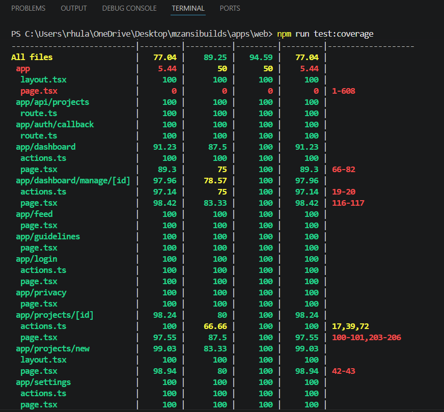
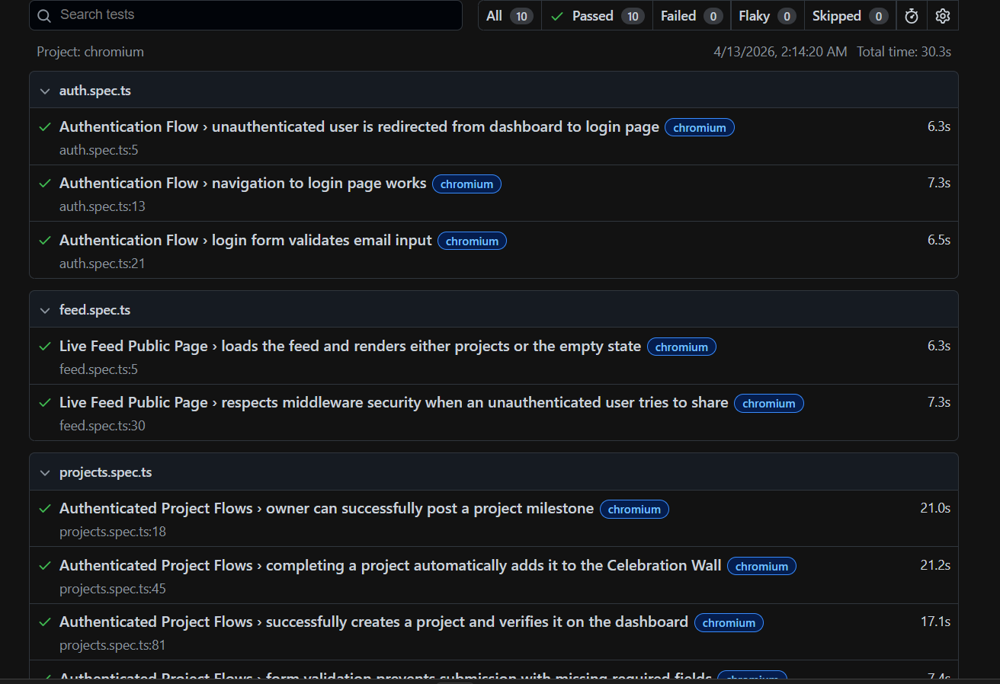
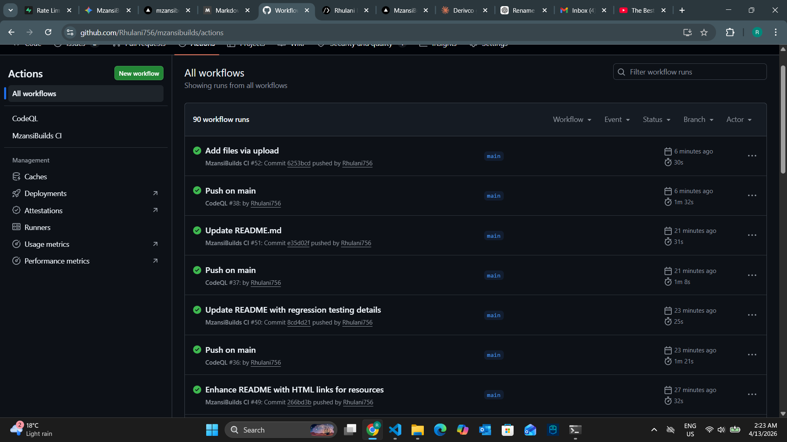

# 🧪 MzansiBuilds Testing Strategy & Summary

**Document Version:** 1.0
**Last Updated:** April 2026

## 1. Overview
The testing strategy for MzansiBuilds is designed to ensure platform stability, protect user data integrity, and guarantee a seamless experience for builders sharing their projects. 

---

### Unit Testing (Jest)
Unit tests form the foundation of our testing strategy. They are fast, isolated, and designed to test individual functions, React components, and utility logic without relying on external services.

<div align="center">
  
  <p><i>Sample output of our automated unit test coverage across the application layer.</i></p>
</div>

* **Framework:** Jest & React Testing Library
* **Location:** `apps/web/__tests__/`
* **Focus Areas:**
  * UI Component rendering and state changes.
  * Utility functions (e.g., date formatting, data parsing).
  * Custom React Hooks.
* **Execution Command:** `npx turbo run test --filter=web`

### Integration Testing
Integration tests verify the "handshake" between our application logic and our infrastructure. Specifically, these tests ensure that our Next.js Server Actions correctly communicate with our PostgreSQL database via Prisma.

* **Framework:** Jest (Configured for Node environment)
* **Focus Areas:**
  * Prisma ORM queries and mutations.
  * Next.js Server Actions.
  * Supabase Authentication state handling.
* **Data Handling:** Integration tests run against a dedicated, isolated test database to ensure production data is never mutated.

### End-to-End (E2E) Testing (Playwright)
E2E tests sit at the top of the pyramid. They simulate real user behavior by spinning up a headless Chromium browser and interacting with the live DOM.

<div align="center">
  
  <p><i>Summary of e2e tests.</i></p>
</div>

* **Framework:** Playwright
* **Location:** `apps/web/e2e/`
* **Focus Areas:**
  * **Authentication Flow:** Signing up, logging in, and secure route protection.
  * **Core User Journeys:** Creating a new project and verifying it appears on the Live Feed.
  * **Browser Validation:** Ensuring native HTML5 form validation triggers correctly.
* **Execution Command:** `npx turbo run test:e2e --filter=web`

---

## CI/CD Pipeline Integration

Testing is strictly enforced via GitHub Actions. Our pipeline ensures that no broken code can be merged into the `main` branch or deployed to Vercel.

<div align="center">
  
  <p><i>The automated gatekeeper: No code reaches production without passing all integration and E2E checks.</i></p>
</div>

**The Automated Workflow:**
1. **Trigger:** Activated on Push or Pull Request to `main` or `develop`.
2. **Linting:** ESLint verifies code style and catches syntax errors.
3. **Test Execution:** Turborepo executes both the Jest and Playwright test suites.
4. **Artifacts:** If a Playwright test fails, a `playwright-report` artifact is automatically uploaded to GitHub.
5. **Deployment Blocker:** Vercel deployment is halted if any test exits with a non-zero status code (Exit Code 1).

---

## Local Development Guide

To run the testing suites locally before opening a Pull Request, ensure you are in the root directory of the monorepo.

**Run Unit Tests:**
```bash
# Run tests for the web application
npx run test 

# Run tests with coverage report
cd apps/web && npm run test:coverage